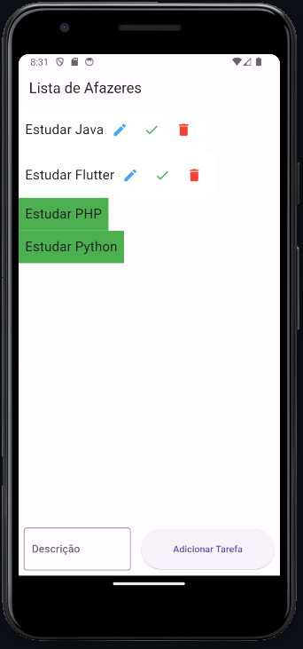
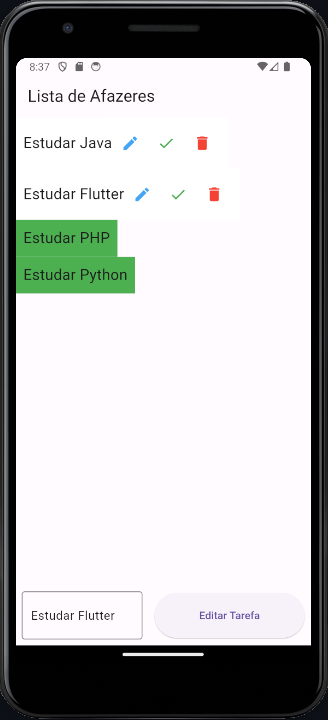

# Projeto Lista de Afazeres

## Funcionalidades Principais

- Adicionar novas tarefas à lista.
- Editar tarefas existentes.
- Marcar tarefas como concluídas.
- Excluir tarefas da lista.

## Tecnologias Utilizadas
- Flutter SDK
- Dart Programming Language

## Como Executar o Projeto

1. Clone o repositório para o seu ambiente local.
2. Abra o projeto no Visual Studio Code ou no Android Studio.
3. Execute o comando flutter pub get para instalar as dependências.
4. Conecte um dispositivo ou inicie um emulador.
5. Execute o comando flutter run para iniciar o aplicativo.